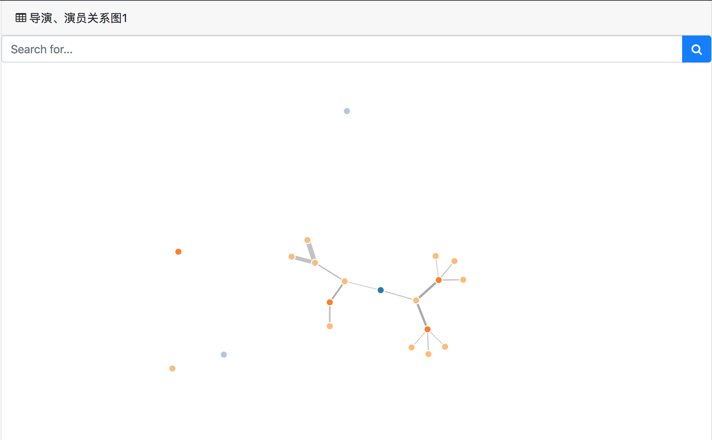
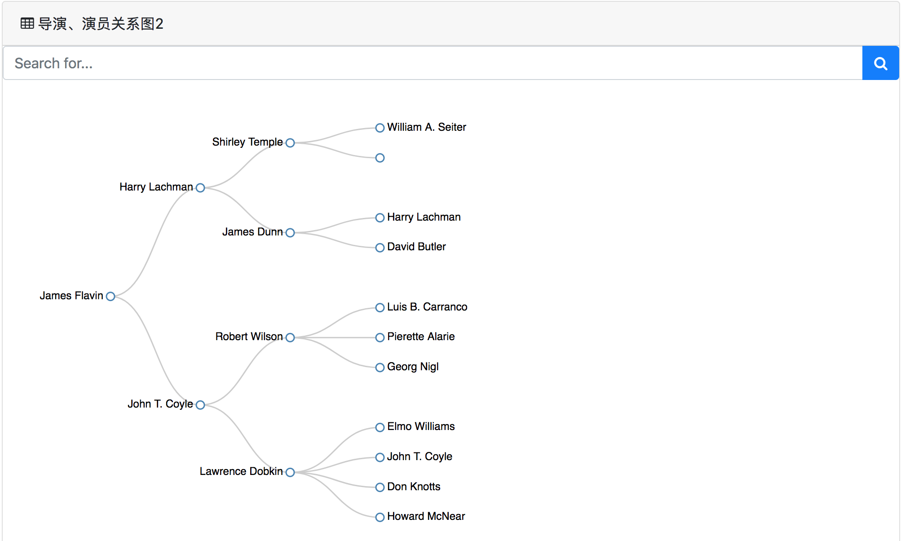
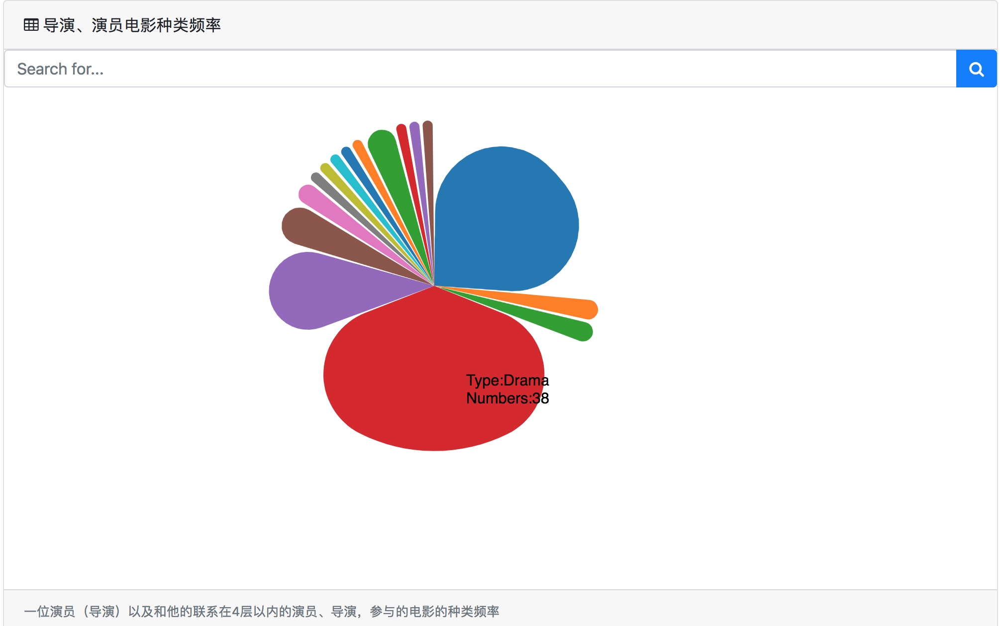

# Directors-Actors-Relation-Map
使用D3框架展示亚马逊20万部电影中的演员、导演之间的关系

## 关系图说明

### 导演、演员参与电影频率

- 选取了参演电影数最多的前25名演员，图中名字的大小代表了他们参演电影数的大小
- 去除 ` ["n/a", "*", "·", "Various", ".", "-", "na", "None"]`等无意义数据

- 选取了拍摄电影数最多的前25名导演，图中名字的大小代表了他们拍摄电影数的大小
- 去除 ` ["n/a", "*", "·", "Various", ".", "-", "na", "None"]`等无意义数据

### 导演、演员关系图1

- 与一位导演（演员）有直接或者间接联系的导演、演员，线的粗细代表了关系的强弱，最多4层关系
- **联系**的定义：与导演（演员）合作最多的前2位导演、演员，记为$a_{1}$，为第1层联系；与$a_{1}$合作最多的的前2位导演、演员，记为$a_{2}$，为第2层联系，以此类推。
- 可在搜索框查询
- 去除 ` ["n/a", "*", "·", "Various", ".", "-", "na", "None"]`等无意义数据

### 导演、演员关系图2

- 与一位导演（演员）有直接或者间接联系的导演、演员，最多4层关系
- **联系**的定义：与导演（演员）合作最多的前2位导演、演员，记为$a_{1}$，为第1层联系；与$a_{1}$合作最多的的前2位导演、演员，记为$a_{2}$，为第2层联系，以此类推。
- 可在搜索框查询
- 去除 ` ["n/a", "*", "·", "Various", ".", "-", "na", "None"]`等无意义数据

### 导演、演员电影种类频率

- 一位演员（导演）以及和他的联系在4层以内的演员、导演，参与的电影的种类频率

- **联系**的定义：与导演（演员）合作最多的前2位导演、演员，记为$a_{1}$，为第1层联系；与$a_{1}$合作最多的的前2位导演、演员，记为$a_{2}$，为第2层联系，以此类推。
- 可在搜索框查询
- 鼠标放上去可显示种类名和具体的电影数
- 去除 ` ["n/a", "*", "·", "Various", ".", "-", "na", "None"]`等无意义数据

